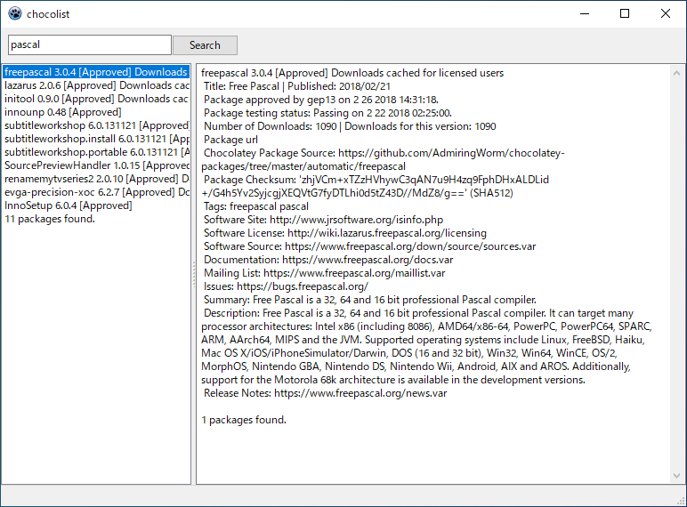
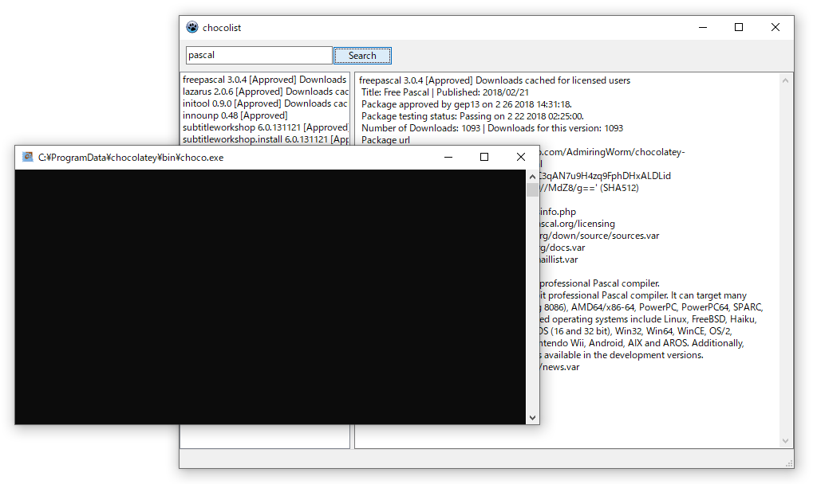

= chocolist

chocolist is a front end of Chocolatey

Features:

* search packages
* show package information

== Note

When you search or get information of a package, you may see blank command window.

